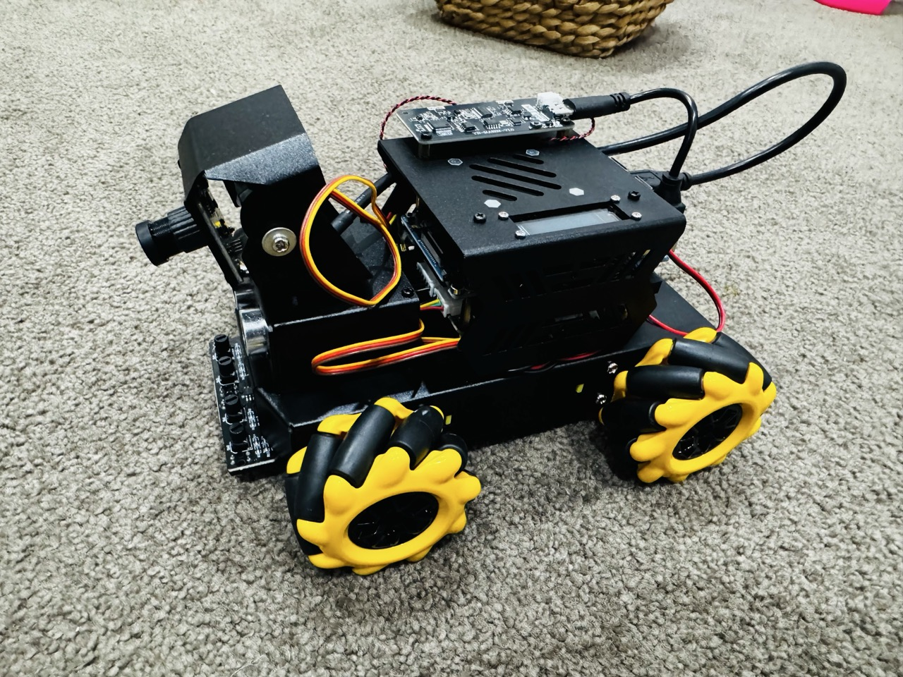
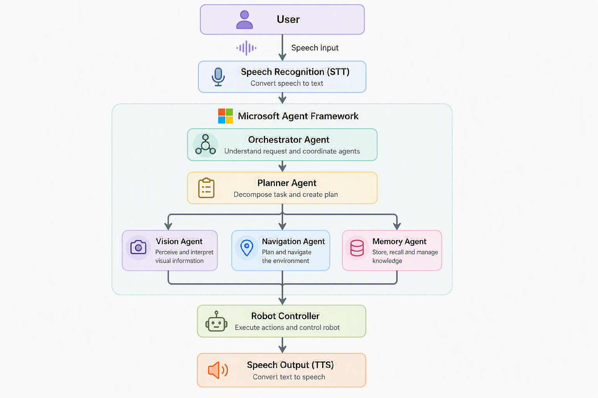

# Ringo — AI Treasure Hunt Robot

> *"Every kid has a remote control car. This is something different."*

Ringo is an AI-powered robot dog that lives inside a Yahboom RaspBot V2 chassis. Built for my daughter Sienna (age 5), Ringo uses voice, vision, and a team of specialist AI agents to go on treasure hunts around the house.

📖 **Full write-up:** [Building an AI-Powered Robot Car with My Daughter Using Microsoft Agent Framework](https://sameeraman.github.io/blog/2026/07/12/raspbotv2-ai-robot/)

---



---

## How It Works

1. **Say "Hey Ringo"** — a local wake word on the AI voice board activates the robot
2. **Chat naturally** — Ringo greets Sienna and has a conversation
3. **Ask for a treasure hunt** — say "find my pink ball" or "let's go on a treasure hunt!"
4. **Ringo plans and searches** — the Planner Agent designs a search strategy, Vision Agent scans the room, Navigation Agent moves the robot
5. **Celebrates when found** — barks, lights up, and tells Sienna what it sees

---

## Architecture

Ringo is built on the **Microsoft Agent Framework** with a team of specialist agents running locally on an Orange Pi 5 Pro. Only AI inference crosses the network to Azure OpenAI.



| Agent | Model | Responsibility |
|-------|-------|----------------|
| **Orchestrator** | `gpt-5.4-mini` | Understands requests, coordinates the team, handles general conversation |
| **Planner** | `o3` | Decomposes treasure hunt goals into executable steps using deep spatial reasoning |
| **Vision** | `gpt-5.4` (multimodal) | Processes camera frames, identifies objects, guides approach navigation |
| **Navigation** | `gpt-5.4-mini` | Controls movement — rotate, strafe, forward/backward, obstacle avoidance |
| **Memory** | `gpt-5.4-mini` | Stores and retrieves past adventures, Sienna's favourites via Azure AI Search |

**Key design principle:** not every agent needs the smartest model. Match capability to task complexity.

---

## Hardware

| Component | Details |
|-----------|---------|
| **Robot chassis** | [Yahboom RaspBot V2](https://category.yahboom.net/products/raspbot-v2) — mecanum wheels, camera mount, sensor platform |
| **Brain** | [Orange Pi 5 Pro](http://www.orangepi.org/html/hardWare/computerAndMicrocontrollers/details/Orange-Pi-5-Pro.html) — Rockchip RK3588S, 8-core CPU, 6 TOPS NPU |
| **Voice board** | Yahboom AI Voice Module — custom firmware for local wake word detection |
| **Display** | SSD1306 128×32 OLED — shows CPU, RAM, battery, robot state |

The Orange Pi 5 Pro was chosen specifically for its integrated NPU — future local object detection (YOLO/OpenCV) without cloud round-trips is already planned.

---

## Quick Start (on Orange Pi)

```bash
# 1. Clone and copy to the Orange Pi
scp -r Raspbotv2-TreasureHunt/ orangepi@<ip>:~/

# 2. SSH in
ssh orangepi@<ip>
cd ~/Raspbotv2-TreasureHunt

# 3. Install dependencies
pip install -r requirements.txt

# 4. Configure Azure credentials
cp .env.example .env
nano .env   # fill in your keys — see .env.example for all required values

# 5. Run (voice + web dashboard)
python main.py

# Or: web dashboard only (for remote control / debugging)
python main.py --web
```

The web dashboard runs at `http://<robot-ip>:8080` and gives you a live camera feed, motor controls, sensor readings, and real-time agent logs.

---

## Azure Services Required

| Service | Purpose | Notes |
|---------|---------|-------|
| Azure OpenAI | Orchestrator, Navigation, Memory agents | `gpt-5.4-mini` deployment |
| Azure OpenAI | Vision Agent — image analysis | `gpt-5.4` multimodal deployment |
| Azure OpenAI | Planner Agent — hunt strategy | `o3` deployment |
| Azure OpenAI | Embeddings for memory | `text-embedding-3-small` deployment |
| Azure Speech | Speech-to-Text (STT) | Listens to Sienna |
| Azure Speech | Text-to-Speech (TTS) | Ringo's voice |
| Azure AI Search | Memory vector store (Phase 2) | Remembers past adventures |

Authentication uses a **service principal** (Entra ID) — no API keys in code. See `.env.example` for the required environment variables.

---

## Project Structure

```
Raspbotv2-TreasureHunt/
├── main.py                  # Entry point — voice loop, wake word, session management
├── config.py                # Environment/settings loader
├── .env.example             # Template for credentials (commit this, not .env)
├── requirements.txt         # Python dependencies
│
├── agents/
│   ├── orchestrator.py      # RingoOrchestrator — coordinates sub-agents
│   ├── vision_agent.py      # VisionAgent — camera perception
│   ├── navigation_agent.py  # NavigationAgent — motor control
│   ├── memory_agent.py      # MemoryAgent — Azure AI Search
│   ├── planner_agent.py     # PlannerAgent (o3) — hunt strategy
│   └── prompts.py           # Ringo's personality + system prompts
│
├── plugins/
│   ├── vision.py            # Camera + GPT-5.4 scene understanding
│   ├── movement.py          # Motor tool functions
│   ├── safety.py            # Session timer + obstacle checks
│   └── memory.py            # Azure AI Search read/write
│
├── hardware/
│   ├── motor.py             # Mecanum wheel controller
│   ├── camera.py            # USB camera capture
│   ├── ultrasonic.py        # Distance sensor
│   ├── lights.py            # RGB LED bar (idle/listen/think/speak/found)
│   ├── lcd.py               # SSD1306 OLED stats display
│   └── wake_word.py         # Serial wake-word listener (binary + ASCII protocols)
│
├── speech/
│   ├── stt.py               # Azure Speech-to-Text
│   └── tts.py               # Azure Text-to-Speech
│
├── web/
│   └── server.py            # FastAPI real-time dashboard (WebSocket camera, logs)
│
└── services/
    └── embedding.py         # Azure OpenAI text embeddings
```

---

## Safety Features

- **Speed-limited** motors (configurable `MAX_MOTOR_SPEED` in `.env`)
- **Ultrasonic obstacle detection** — stops before collisions
- **Session time limit** — gently tells Sienna when playtime is up
- **Cancellable AI sessions** — Ctrl+C, wake word interrupt, or web Emergency Stop all instantly cancel running agent chains and stop motors
- **Child-friendly language** — prompts enforce simple, fun responses

---

## Engineering Notes

**Agent-as-tool pattern** — Each sub-agent is just an `async def` function to the parent. No framework magic needed; composable and independently testable.

**LLM output as hardware signal** — The model outputs `[BARK]` to trigger the real bark sound, `*tilts head*` to trigger a head shake. Tags are stripped before TTS; physical actions fire in background threads.

**ALSA exclusive lock** — Azure Speech SDK holds `plughw` open after first TTS call. The synthesizer is reset before each bark sound to release the lock.

**Asyncio task cancellation** — The entire session runs as one `asyncio.Task`. Any stop signal calls `loop.call_soon_threadsafe(task.cancel)` — safe from serial callbacks, web threads, or signal handlers.

---

## What's Next

- [ ] Local object detection on the Orange Pi NPU (YOLO / OpenCV) — biggest latency win
- [ ] Multi-room navigation memory — store a map, know which room the robot is in
- [ ] Better wake word hardware with noise cancellation (especially for kids)
- [ ] Battery optimisation — extend beyond 20-minute sessions
- [ ] Biscuit (Sienna's requested friend for Ringo — v3 scope)

---

## License

Personal project — built with ❤️ for Sienna.
